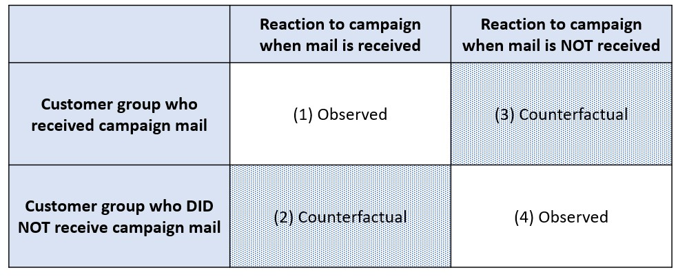
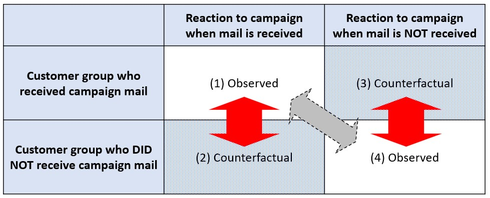

# Why Does Causality Analysis Matter?

Here we define the *Causality Analysis* is a field of study to establish the relationship between cause and effect from the data. Why does it matter though?

In a sentence, that is because **"correlation does not indicate the causation"**.

<a href="https://www.wnycstudios.org/podcasts/otm/articles/spurious-correlations">Deaths by Swimming Pool Drowning vs. Nicholas Cage Films</a> a famous example of this statement.

Although "the number of people who drowned by falling into the swimming pool" is correlated with "the number of films Nicolas Cage appeared in", it does not mean they have causal relationship (no proof, but just by common sense!)

Therefore, this is an easy example of correlation != causation, period.

$ $

Although it is true, there is further implication in the data science field: it matters when we want to know the **influence by the actions changing a part of the system**. In the example above, <ins>decreasing the Nicolas Cage's films does not lead to the decrease in the pool accidents</ins> (again no proof but in common sense.)

But there are many cases that this kind of effect is what we actually want to know, for example:
- how likely a patient can be treated if the doctor administered a drug,
- how likely we see more conversions if a marketing campaign went-live,
- how likely the city can gain more budget when a tax policy was enforced,
- etc.

This is also known as *do-operator* in the causality analysis <a href="http://mlg.eng.cam.ac.uk/zoubin/tut06/cambridge_causality.pdf">(a reference here)</a> like $E[Y=y | A]$ vs. $E[Y=y | do(A)]$. No matter how it is called, this difference is something we should carefully concern and distinguish.

$  $

# Concept of Counterfactual

In *causality analysis*, smacking *counterfactual* property of the real world is the key to approach to measure the effect in our interest.

Imagine that we have sent out campaign mails to selected customer groups (by possible propensity of reaction or etc.). We have two customer groups: one who received the mail, the other who didn't. Each of them returns some responses to the mail.

In this exhibit, we only have the data for *(1)* and *(4)*. Unfortunately, the difference between *(1)* and *(4)* does not represent the causal effect in general, and biased. This is because when we send a campaign mail, we already see the customers attributes, past sales, etc. and cherry-pick them. The customers we send the mail is possibly the customers who are aready likely to respond positively. If that is the case, the campgain effect is overestimated.

What we really want to konw is the difference between *(1)* and *(2)*, not *(4)*, and/or between *(3)* and *(4)*, not *(1)*. With that information, we can discuss the campaign mail has done the expected job.

Since the information of *(2)* and *(3)* does not appear in the real world, it is called <b><ins>counterfactual</ins></b>. 

A guru of causality analysis, Donald Rubin called this counterfactual aspect of the observed data as "the fundamental problem of causal inference" <a href="https://en.wikipedia.org/wiki/Rubin_causal_model#The_fundamental_problem_of_causal_inference">(Wikipedia)</a>

$ $

As discussed later, RCT is one possible approach to overcome this problem and the method highly ranked in the hierarchy of the strengh of the evidence in the scientific research <a href="https://en.wikipedia.org/wiki/Hierarchy_of_evidence">("Hierarchy of evidence")</a>, yet because RCT is not always possible to conduct, the importance of causality analysis still remains. We will discuss more in the later sections.

$  $

# Approaches to Reach Couterfactual in Special Circumstances
- DID
- RDD
- Instrumental Variable (IV) Estimation

XXXXXXXXXXXXXXXXXXXX [TO BE ENRICHED LATER] 

$  $

# ATE (Average Treatment Effect) and ATT (Average Treatment Effect of the Treated)

Suppose $Y$ is an outcome random variable, $A$ is a indicator variable to represent the presence of treatment, for example $A \in \lbrace 0,1 \rbrace$ in binary treatment case. For example, $A=1$ is a condition to represent the diabetes patient population is administered the insulin, while $A=0$ is for not administered.

Also, suppose $Y^{a}$ is an outcome when the treatment is SET to $a$; for example, $Y^{a=1}$ is an outcome random variable when the treatment class is $1$ regardless of the actual treatment applied in observing $Y$. This means the random variable $Y^{a=1} | A=0$ can exist and this represents the 'what-if' value of $Y$ in a sense that it is the random variable under the condition of not being treated ( $A=0$ ) but what if it was treated ( $a=1$ ).

For example, $Y^{a=1} | A=0$ can give the random variable of *HbA1C* for the patient group who was not administered the insulin but in the virtual case if they had been administered. 

Here the $ATE$ (Average Treatment Effect) and $ATT$ (Average Treatment Effect of the Treated) are introduced.

$ $

## *ATE* (Average Treatment Effect)

$ATE \ = \ \mathbb{E}[Y^{a=1}-Y^{a=0}]$

This represents the expectation of the effect of the treatment in a sense it takes the difference of the outcome random variables, the former is if whole population was set in the treated group while the latter is if set in the non-treated group.

$ $

## *ATT* (Average Treatment Effect of the Treated)

$ATT \ = \ \mathbb{E}[Y^{a=1}-Y^{a=0}|A=1]$

This represents the similar expectatino of effect to *ATE* with the only difference in the random variable in interest are only from the population who was actually treated because it is conditioned by $A=1$.

$ $

## *ATE* vs. *ATT* in an example

Let's describe the difference of *ATE* and *ATT* in English with an example of insulin patient. 

- *ATE* is the expected effect of insulin (e.g. decrease in *HbA1C*) against the entire population in interest.

- *ATT* is the expected effect of insulin against the population who was actually given insulin, and disregarding the population who was not given insulin--supposedly they are severer diabetic patients because the physicians found out they should take the insulin.

$  $

# Rondomized control trial

If the treatment assignment is randomly controlled where the assignment of $A$ is random, the calculation of *ATE* is much easier, because it is equivalent to the average of observed outcomes in each group:

$\mathbb{E}[Y|(A=1) \ - \ Y|(A=0)] \ = \ \mathbb{E}[Y|(A=1)] \ - \ \mathbb{E}[Y|(A=0)]$.

In the insulin example, this happens when the patients given insulin are the ones selected randomly with no influence from any attributional factors such as the disease severity, age, or etc. In this situation, we can get the unbiased estimate of effect of insulin by just taking the average of difference of *HbA1C* in the population assigned to treatment group and that in the population assigned to non-treatment group.

$ $

Here's the proof of this property:

------------------

When $A$ is assigned randomly, $Y_{a} \perp A$ for $a \ \in \ \lbrace 0,1 \rbrace$. This leads to:

$Y^{a=1} \ = \ Y^{a=1}|(A=1) \ = \ Y^{a=1}|(A=0)$ and $Y^{a=0} \ = \ Y^{a=0}|(A=0) \ = \ Y^{a=0}|(A=1)$, (also known as *exchangeability*).

Here, under the RCT set up, we can say the assignment of treatment/non-treatment group $A=a'$ is equivalized to the use of set notation $Y_{a=a'}$ (in RCT, two groups of sujects are 'forced' to comply with the individual assignment).

This should result in:

$Y^{a}|(A=a) \ = \ Y|(A=a)$ when $a \ \in \lbrace 0,  1 \rbrace$. (also known as *consistency*)

$ $

Therefore,

$$
\begin{aligned}
ATE \ & = \ \mathbb{E}[Y^{a=1} \ - \ Y^{a=0}] \\
& = \ \mathbb{E}[Y^{a=1}] \ - \ \mathbb{E}[Y^{a=0}] \\
& = \ \mathbb{E}[Y^{a=1}|A=1] \ - \ \mathbb{E}[Y^{a=0}|A=0] \\
& = \ \mathbb{E}[Y|A=1] \ - \ \mathbb{E}[Y|A=0] \\
& = \ treatment \ effect \ calculated \ under \ RCT
\end{aligned}
$$

Where the second line to the third uses *exchangeability* and the third to the fourth uses *consistency*.

Now, it proves that $ATE \ = \ treatment \ effect \ calculated \ under \ RCT$

------------------

$ $

This indicates that under the RCT set up, it is possible to say that the difference in plain averages of each group (treatment/non-treatment (control)) directly becomes the unbiased estimate of the ATE.

$ $

Although it is true that RCT solves the issue in the estimate of treatment effect, it is not always possible to do RCT in real life for various reasons in costs, ethics, and etc. Also, let's take the fact into account that there is already a lot of data collected through non-RCT context ready for being utilized without further data collection efforts. That is why the studies in how to get the value of treatment effect through observational data are appreciated.

$  $

# Population Bias as A Type of Counterfactuality

The challenge appears though when using observational data. Primarily, the lack of $Y_{a} \perp A$ or *exchangeability* is an issue. In plain English, this means the outcome for the treated group and the outcome for the untreated group are not equivalent. For examples:
- the effect of insulin is not the same to the patients who are administered and the ones who are not; because it depends on the doctors' discretions and the former patient group is supposedly under severer condition than the latter.
- the effect of marketing campaign such as coupon distribution is not the same to the customers who received the coupon and the ones who do not; because it depends on the marketing team's discretion and the former customer group is supposedly promising and sensitive to the campaign than the latter.

In general, this limitation is just called **population bias**. Next section shows one of the possible approaches we can take to tackle this limitation and get the unbiased estimate of the treatment effect.

$  $

# Inverse Probability Weighting

## Covariates *X*
Here, let's introduce the covariates $X$, which controls the bias in population and if stratified by it, the population becomes homogenenous in the assignment $A$ and the assignment $A$ is independent of the statistics in interest, $Y$. Formalized, this is property is written as:

$$Y \perp A | X$$

This property is called *conditional exchangeability*. Compared with the *exchangeability* in the RCT section above, it means the RCT-like situation is happening once stratified by $X$.

Some examples of the $X$ are:
- When the physician decides the administration of insulin by patients' severity class ($X$), the administration of insulin ($A$) is no longer dependent of the possible improvement of HbA1c ($Y$), once stratified by the severity class.
- When the coupon distribution plan is determined by the customer segmentation defined by each customer's age, gender, and frequency in past purchases ($X$), the coupon price ($A$) is no longer dependent of the possible conversion probability ($Y$), once stratified by the customer segmentation.

As in the second example, $X$ can contains multiple variables to control $A$ and $Y$.

$ $

## Assumptions of inverse probability weighting
The inverse probability weighting depends on the following assumptions:
- **Conditional exchangeability**: as mentioned above.
- **Consistency**: the same as mentioned in the RCT section above. This assumes *$Y^{a}=Y|A=a$*. This means that the observed $Y$ conditioned by $A=a$ is the same as the $Y$ intentionally controled at $A=a$ (which is $$Y^{a}$. This may sound weird or an matter of course, but let's think of the following example.If $A=1$ represents the presence of regular excercises, and $Y$ the weight of the person. $Y|A=1$ is the weight when they regularly works out, while $Y^{a=1}$ is the weight they are assigned to be a workout group. They can be very different in a way of how frequent, how hard, how long etc., the former excercise is by the person's preference, but the latter is by the instruction in the experiment usually in exchange of rewards for the participation. It is not usually to the effect to be consistent. The consistency assumtion still assume they are the same.
- **Positivity**: This assumes $P[A=a|X=x] > 0$ for any $a$ and $x$ where $P[X=x]>0$. This is the scenario where every assignment happens in the any possible $X$.

$ $

## Inverse provability weighting
When we can get the probabilities of the assignment, i.e. $P[A=1|X]$ and $P[A=0|X]$, it is possible to get the unbiased estimate of *ATE* and *ATT* from the observational data. This method is called Inversed Probability Weighting.

Under the observational data, we have a set of observational data, $\lbrace ( Y_{i}, A_{i}, X_{i}, P[A_i|X_i] ) \rbrace^{n}\_{i=1}$. You may wonder what can bring us $P[A_i|X_i]$ as a part of the data, but let's take it as an assumption for now; actually it is not rediculous because this can easily happen when we control the probability. For example, the marketing team may decide whether they send a marketing mail or not based on $X$, stochastically in a probability $P[A|X]$, which is determined by the customer's segment $X$.

The Inversed Probability Weighted Estimator (*IPWE*) is given by:

$\hat{\mu}^{IPWE}\_{a} \ = \ \frac{1}{n} \sum\limits_{i=1}^{n} Y_{i} \frac{\boldsymbol{1}\_{A_i=a}}{P[A_i=a|X_i]}$

Where the $\boldsymbol{1}\_{A_i=a}$ represents an indicator function to give $1$ when $A_i=a$ and $0$ otherwise.

$ $

This *IPWE* is an unbiased estimator of the mean of $Y^{a}$, which is $\mathbb{E}[Y^{a}]$; namely $\mathbb{E}\_{A}[\hat{\mu}^{IPWE}\_{a}] \ = \ \mathbb{E}[Y^{a}]$.

Then, we can conclude the *ATE* can be estimated such that:

$ATE \ = \ \mathbb{E}[Y^{a=1}-Y^{a=0}] \ = \ \mathbb{E}[\hat{\mu}^{IPWE}\_{1} \ - \ \hat{\mu}^{IPWE}\_{0}] \ = \ \mathbb{E}[\frac{1}{n} \sum\limits_{i=1}^{n} Y_{i} \frac{\boldsymbol{1}\_{A_i=1}}{P[A_i=1|X_i]} \ - \ \frac{1}{n} \sum\limits_{i=1}^{n} Y_{i} \frac{\boldsymbol{1}\_{A_i=0}}{P[A_i=0|X_i]}]$

Now, let look at the $\frac{1}{n} \sum\limits_{i=1}^{n} Y_{i} \frac{\boldsymbol{1}\_{A_i=a}}{P[A_i=a|X_i]}$ carefully. This is an average of $Y_{i}$ weighted by $\frac{\boldsymbol{1}\_{A_i=a|X}}{P[A_i=a|X_i]}$. The numerator of this weighing factor says we can ignore the case we don't observe because it is zero any way, and the denominator says that yet we have to scale up the observed $Y_i$ by a factor of inverse probability of $P[A_i=a|X_i]$. 

All of these can be given from the observation data, then we can estimate the *ATE* from the observation.

Similarly, the 

$    $

$ $

Here's the proof of $\mathbb{E}\_{A}[\hat{\mu}^{IPWE}\_{a}] \ = \ \mathbb{E}[Y^{a}]$:

------------------

Giving the proof only in case of $a'=1$. $a'=0$ is just symmetric and can be proved similarly.

$$
\begin{aligned}
\mathbb{E}[\hat{\mu}^{IPWE}\_{1}] \ & = \ \mathbb{E}[\frac{1}{n} \sum\limits_{i=1}^{n} Y_{i} \frac{\boldsymbol{1}\_{A_i=1}}{P[A_i=1]}] \\
& = \ \frac{1}{n} \sum\limits_{i=1}^{n} Y_{i} \frac{ \mathbb{E}[\boldsymbol{1}\_{A_i=1}]}{P[A_i=1]}
\end{aligned}
$$

XXXXXXXXXXXXXXXXXXXX [TO BE ENRICHED LATER] 

------------------

$ $

## Example applicaton of inverse provability weighting

XXXXXXXXXXXXXXXXXXXX

## Estimating probability -- propensity score
When $P[A=a|X]$ is not given, it has to be estimated. This way we are given the data $\lbrace ( Y_{i}, A_{i}, X_{i}) \rbrace^{n}_{i=1}$. In general, the estimation is done by logistic regression, but there are also applications of machine learning methodologies here. Once $\hat{P}[A=a|X]$ is estimated, the other procedures are the same. 

Some new discussions can appear here: how much the estimation of the $\hat{P}[A=a|X]$ is reliable or what if $\hat{P}[A=a|X]$ is super close to zero (=the weighing in IPWE gets too large). To tackle those possibilies, there are some variants proposed, which this post does not include because it is completely out of scope.

$  $

# Double Machine Learning

$  $

# Reference

- [1] "Causal Inference: What If", Miguel A. Hernan, James M. Robins, CRC Press, https://www.hsph.harvard.edu/miguel-hernan/causal-inference-book/
- [2] "CAUSALITY", Ricardo Silva, Cambridge Advanced Tutorial Lecture Series on Machine Learning, http://mlg.eng.cam.ac.uk/zoubin/tut06/cambridge_causality.pdf
- [3] "Stratification and weighting via the propensity score in estimation of causal treatment effects: a comparative study", Jared K Lunceford, Marie Davidian, 2004, STATISTICS IN MEDICINE, https://pubmed.ncbi.nlm.nih.gov/15351954/

